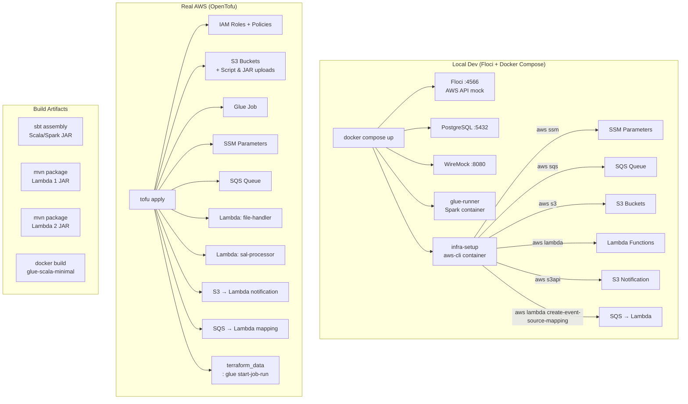
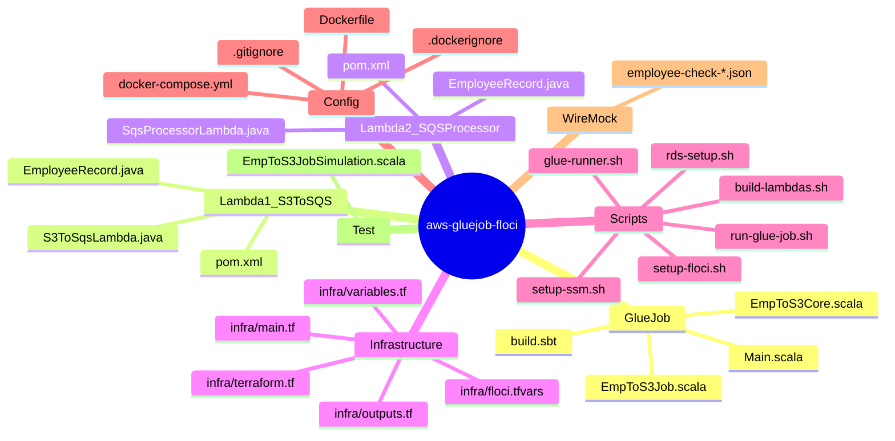
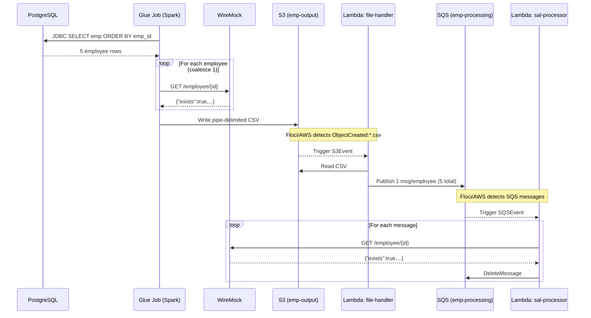

# Architecture Diagram

## Data Flow

```mermaid
flowchart LR
  subgraph DataSources["Data Sources"]
    PG[("PostgreSQL\nemp table")]
  end

  subgraph Compute["Compute Layer"]
    GLUE["AWS Glue Job\nScala/Spark\nEmpToS3Core"]
    L1["Lambda: employee-file-handler\nJava 17\nS3Event → SQS"]
    L2["Lambda: employee-sal-processor\nJava 17\nSQS → WireMock"]
  end

  subgraph Storage["Storage & Messaging"]
    S3_OUT[("S3: emp-output\npipe-delimited CSV")]
    SQS[("SQS: emp-processing\n1 msg / employee")]
    SSM[("SSM Parameter Store\n/emp/api/endpoint\n/emp/sqs/queue-url\n/emp/api/employee-check-enabled")]
  end

  subgraph ExternalAPI["External API"]
    WM["WireMock :8080\nGET /employee/{id}"]
  end

  subgraph Logging["Logging (current)"]
    L1_LOG["stdout / stderr\ncontext.getLogger"]
    L2_LOG["stdout / stderr\ncontext.getLogger"]
    GLUE_LOG["println"]
    S3_LOG[("CloudWatch Logs\nauto (AWS deploy)")]
  end

  PG -->|JDBC query| GLUE
  GLUE -->|GET /employee/{id}| WM
  GLUE -->|pipe-delimited CSV| S3_OUT
  S3_OUT -->|S3 ObjectCreated:*.csv| L1
  L1 -->|1 SQS message / record| SQS
  SQS -->|SQSEvent| L2
  L2 -->|GET /employee/{id}| WM
  L1 -.->|reads at init| SSM
  L2 -.->|reads at init| SSM
  GLUE -.->|reads at init| SSM

  L1 -.-> L1_LOG -.-> S3_LOG
  L2 -.-> L2_LOG -.-> S3_LOG
  GLUE -.-> GLUE_LOG -.-> S3_LOG
```

## Deployment & Infrastructure



## Component Map



## Sequence (End-to-End Flow)


