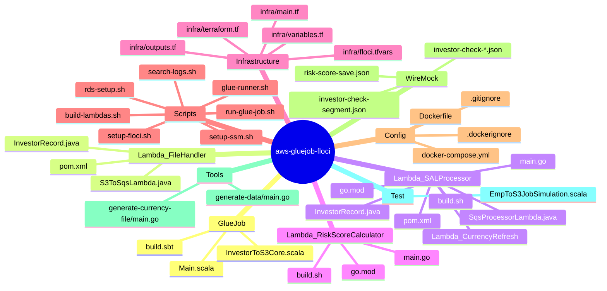
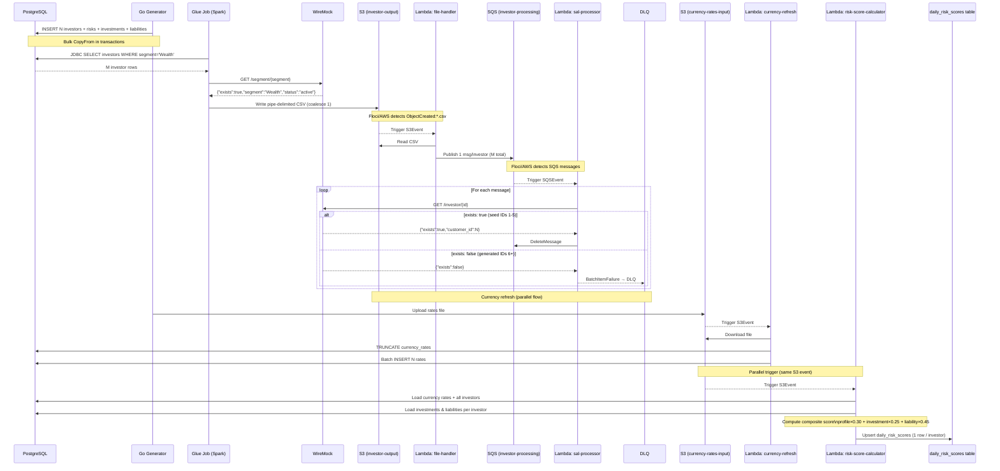

# Architecture

## Data Flow

```mermaid
flowchart LR
  subgraph DataSources["Data Sources"]
    PG[("PostgreSQL\n7 tables")]
    CUR_FILE["Currency Rates File\npipe-delimited CSV"]
  end

  subgraph Compute["Compute Layer"]
    GLUE["AWS Glue Job\nScala/Spark\nInvestorToS3Core"]
    L1["Lambda: investor-file-handler\nJava 17\nS3Event → SQS"]
    L2["Lambda: investor-sal-processor\nJava 17\nSQS → WireMock + DB"]
    L3["Lambda: currency-refresh\nGo (provided.al2023)\nS3 → pgx batch"]
    L4["Lambda: risk-score-calculator\nGo (provided.al2023)\nS3 → DB scores"]
  end

  subgraph Storage["Storage & Messaging"]
    S3_OUT[("S3: investor-output\npipe-delimited CSV")]
    S3_CUR[("S3: currency-rates-input")]
    SQS[("SQS: investor-processing\n1 msg / investor")]
    DLQ[("SQS: DLQ\nfailed investors")]
    SSM[("SSM Parameter Store\n/investor/api/endpoint\n/investor/sqs/queue-url")]
  end

  subgraph ExternalAPI["Mock API"]
    WM["WireMock :8080\nGET /investor/{id}\nGET /segment/{segment}\nPOST /risk-score/{id}"]
  end

  PG -->|JDBC query| GLUE
  GLUE -->|GET /segment/{segment}| WM
  GLUE -->|pipe-delimited CSV| S3_OUT
  S3_OUT -->|S3 ObjectCreated:*.csv| L1
  L1 -->|1 SQS message / record| SQS
  SQS -->|SQSEvent| L2
  L2 -->|GET /investor/{id}| WM
  L2 -->|query risk scores| PG
  L2 -->|POST /risk-score/{id}| WM
  L2 -->|exists:false → DLQ| DLQ

  S3_CUR -->|S3 ObjectCreated:*| L3
  L3 -->|TRUNCATE + batch INSERT| PG
  S3_CUR -->|S3 ObjectCreated:*| L4
  L4 -->|read investors + rates| PG
  L4 -->|upsert daily_risk_scores| PG

  L1 -.->|reads at init| SSM
  L2 -.->|reads at init| SSM
  GLUE -.->|reads at init| SSM
```

## Deployment & Infrastructure

```mermaid
flowchart TD
  subgraph LocalDev["Local Dev (Floci + Docker Compose)"]
    DC["docker compose up"]
    DC --> FLOCI["Floci :4566\nAWS API mock"]
    DC --> PG["PostgreSQL :5432"]
    DC --> WM["WireMock :8080"]
    DC --> GR["glue-runner\nSpark container"]
    DC --> IS["infra-setup\naws-cli container"]
    IS -->|aws ssm| SSM[SSM Parameters]
    IS -->|aws sqs| SQS[SQS Queue + DLQ]
    IS -->|aws s3| S3_BUCKETS[S3 Buckets]
    IS -->|aws lambda|     LAMBDAS[Lambda Functions\nfile-handler, sal-processor\ncurrency-refresh\nrisk-score-calculator]
    IS -->|aws s3api| S3_NOTIF[S3 Notifications\ninvestor-output + currency-rates-input]
    IS -->|aws lambda create-event-source-mapping| SQS_MAP[SQS → Lambda mapping]
  end

  subgraph AWSDeploy["Real AWS (OpenTofu)"]
    TF["tofu apply"]
    TF --> TF_IAM[IAM Roles + Policies]
    TF --> TF_S3[S3 Buckets\n+ Script & JAR uploads]
    TF --> TF_GLUE[Glue Job]
    TF --> TF_SSM[SSM Parameters]
    TF --> TF_SQS[SQS Queue + DLQ]
    TF --> TF_L1[Lambda: file-handler]
    TF --> TF_L2[Lambda: sal-processor]
    TF --> TF_S3N[S3 → Lambda notification]
    TF --> TF_SQSM[SQS → Lambda mapping]
    TF --> TF_CW[CloudWatch Log Groups]
    TF --> TF_RUN[terraform_data\n: glue start-job-run]
  end

  subgraph BuildChain["Build Artifacts"]
    SBT["sbt assembly\nScala/Spark JAR"]
    MVN1["mvn package\nLambda 1 JAR"]
    MVN2["mvn package\nLambda 2 JAR"]
    GO_BUILD1["go build + zip\ncurrency-refresh bootstrap"]
    GO_BUILD2["go build + zip\nrisk-score-calculator bootstrap"]
    DOCKER["docker build\nglue-scala-minimal"]
  end
```

## Component Map



## Sequence (End-to-End Flow)


