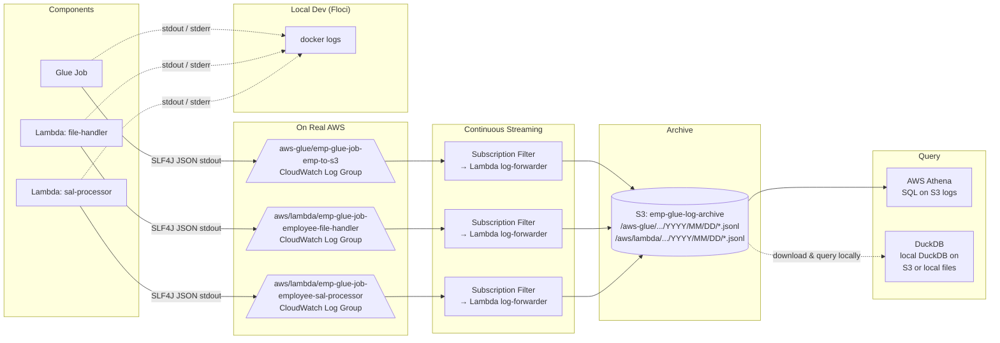
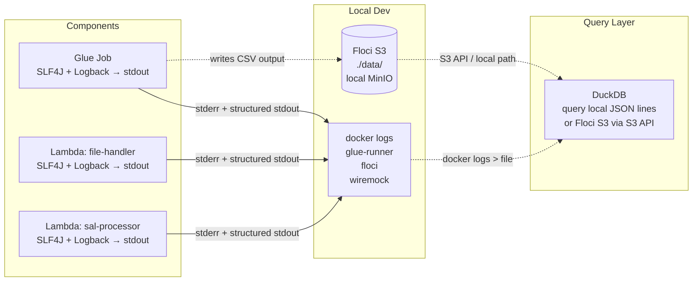

# Logging Analysis & Migration Plan

## Current State

Every component uses ad-hoc `println` / `System.out` / `System.err` / `context.getLogger()` with no structured logging library.

| Component | Current Mechanism | Statements |
|-----------|------------------|------------|
| Glue Job (Scala/Spark) | `println()` / `System.err.println()` | 7 in `EmpToS3Core.scala`, 2 in `Main.scala` |
| Lambda 1: file-handler | `context.getLogger().log()` (handler) + `System.out/err` (main) | 11 total |
| Lambda 2: sal-processor | `context.getLogger().log()` (handler) + `System.out/err` (main) | 16 total |

## Where Logs Go



### Real AWS
- **Lambda** stdout/stderr → CloudWatch Logs automatically (managed service).
- **Glue** stdout/stderr → CloudWatch Logs via `continuous-log-*` job args + the `cloudwatch-*.jar` on the classpath.
- **CloudWatch → S3** via subscription filter → Lambda (`log-forwarder`) → S3 bucket — **continuous, real-time streaming** of every log line.
- **Query** via Athena SQL on the S3 log files, or DuckDB on downloaded files.

### Local Dev (Floci)
- All stdout/stderr → `docker logs` (no CloudWatch available in Floci).
- Query via DuckDB on docker log output (see "Local Dev Approach" below).

## Can We Use SLF4J + Logback?

**Yes, for both Lambda (Java) and Glue (Scala).** Here's what's needed:

### Lambda (Java) — SLF4J + Logback

Add to `pom.xml` (both lambdas):

```xml
<dependency>
  <groupId>ch.qos.logback</groupId>
  <artifactId>logback-classic</artifactId>
  <version>1.5.16</version>
</dependency>
<dependency>
  <groupId>org.slf4j</groupId>
  <artifactId>slf4j-api</artifactId>
  <version>2.0.16</version>
</dependency>
```

Create `src/main/resources/logback.xml`:

```xml
<configuration>
  <appender name="JSON" class="ch.qos.logback.core.ConsoleAppender">
    <encoder class="net.logstash.logback.encoder.LogstashEncoder"/>
  </appender>
  <root level="INFO"><appender-ref ref="JSON"/></root>
</configuration>
```

Optional: add `net.logstash.logback:logstash-logback-encoder` for structured JSON.

Then replace `System.out.println` with:

```java
import org.slf4j.Logger;
import org.slf4j.LoggerFactory;

private static final Logger log = LoggerFactory.getLogger(S3ToSqsLambda.class);
// ...
log.info("Processing s3://{}/{}", bucket, key);
log.error("SSM read failed for {}: {}", paramPath, e.getMessage());
```

Note: `context.getLogger()` can still be used alongside SLF4J — it writes to the same Lambda stdout. But switching entirely to SLF4J is cleaner.

### Glue Job (Scala) — SLF4J + Logback

Add to `build.sbt`:

```scala
"ch.qos.logback" % "logback-classic" % "1.5.16",
"org.slf4j" % "slf4j-api" % "2.0.16",
"net.logstash.logback" % "logstash-logback-encoder" % "8.0" % Optional,
```

Add `src/main/resources/logback.xml` (same as Lambda). Replace `println` with:

```scala
import org.slf4j.LoggerFactory

private val log = LoggerFactory.getLogger(getClass)
// ...
log.info(s"=== Checking employees via API: $effectiveApiEndpoint ===")
log.warn(s"Employee $empId ($name): API call failed - ${e.getMessage}")
```

### Important: Spark Already Ships SLF4J + Log4j

Glue/Spark bundles log4j-over-slf4j. Adding Logback means **removing** or **excluding** the embedded log4j to avoid classpath conflicts. In `build.sbt`:

```scala
// Exclude the embedded log4j from Spark deps
excludeDependencies ++= Seq(
  ExclusionRule("org.apache.logging.log4j", "log4j-slf4j-impl"),
  ExclusionRule("org.apache.logging.log4j", "log4j-core"),
)
```

## Porting All Logs to CloudWatch

### Infrastructure (Terraform)

All components now have dedicated CloudWatch Log Groups, defined in `infra/main.tf`:

| Component | Log Group | Retention |
|-----------|-----------|-----------|
| Glue Job | `/aws-glue/${var.project_name}-emp-to-s3` | `var.log_retention_days` (default 30) |
| Lambda: file-handler | `/aws/lambda/${var.project_name}-employee-file-handler` | `var.log_retention_days` |
| Lambda: sal-processor | `/aws/lambda/${var.project_name}-employee-sal-processor` | `var.log_retention_days` |

Glue continuous logging is enabled via job arguments:
```hcl
"--continuous-log-logGroup"          = "/aws-glue/${var.project_name}-emp-to-s3"
"--continuous-log-logStreamPrefix"   = "driver"
"--enable-continuous-cloudwatch-log" = "true"
"--enable-continuous-log-filter"     = "true"
```

### CloudWatch → S3 Continuous Streaming

Every log line from all 3 components is streamed to S3 in real time:

```
CloudWatch Log Group
  → Subscription Filter (no filter pattern = all logs)
    → Lambda: emp-glue-job-log-forwarder (Python 3.12)
      → S3: emp-glue-log-archive/<log-group>/YYYY/MM/DD/<stream>/<request-id>.jsonl
```

**How it works:**
1. Each CloudWatch Log Group has a **subscription filter** with an empty filter pattern (captures all logs).
2. The filter invokes the **log-forwarder Lambda** with a compressed batch of log events.
3. The Lambda decompresses, reformats, and writes each batch as a newline-delimited JSON file (`.jsonl`) to S3.
4. Files are partitioned by log group, date, stream, and request ID for easy querying.

**Lambda code** (inline in `data.archive_file.log_forwarder`):
```python
import gzip, json, base64, os
from datetime import datetime, timezone
import boto3

s3 = boto3.client("s3")
BUCKET = os.environ["LOG_EXPORT_BUCKET"]

def lambda_handler(event, context):
    payload = gzip.decompress(base64_decode(event["awslogs"]["data"]))
    logs = json.loads(payload)
    group = logs["logGroup"]
    stream = logs["logStream"]
    now = datetime.now(timezone.utc)
    prefix = f"{group}/{now:%Y/%m/%d}/{stream}/{context.aws_request_id}"
    lines = "\n".join(json.dumps(e) for e in logs["logEvents"])
    s3.put_object(Bucket=BUCKET, Key=f"{prefix}.jsonl", Body=lines)
```

### Querying S3 Logs

**Athena (on AWS):**
```sql
CREATE EXTERNAL TABLE IF NOT EXISTS emp_logs (
  id STRING, timestamp BIGINT, message STRING,
  level STRING, logger STRING, thread STRING
)
ROW FORMAT SERDE 'org.openx.data.jsonserde.JsonSerDe'
LOCATION 's3://emp-glue-log-archive/aws-glue/emp-glue-job-emp-to-s3/';

SELECT level, message FROM emp_logs
WHERE level = 'ERROR'
  AND date_format(from_unixtime(timestamp / 1000), '%Y-%m-%d') = '2026-07-02';
```

**DuckDB (locally, after downloading):**
```bash
aws s3 sync s3://emp-glue-log-archive/ /tmp/logs/
duckdb -c "
  SELECT level, count(*) as cnt
  FROM read_json_auto('/tmp/logs/**/*.jsonl')
  GROUP BY level ORDER BY cnt DESC;
"
```

## Local Dev Approach: S3 (Floci) + DuckDB (Recommended)

Since this is local dev/testing on a developer machine, OpenSearch/Splunk are overkill. Simpler: structured JSON logs → stdout → DuckDB on local files.

### Architecture



### How It Works

**Step 1 — SLF4J + Logback with JSON encoder**

All components emit newline-delimited JSON to stdout. Example log line:

```json
{"@timestamp":"2026-07-02T10:30:00.123Z","level":"INFO","logger":"com.example.EmpToS3Core","message":"Employee 1 (Alice Johnson): API response OK","emp_id":1,"thread":"main"}
```

Using `logstash-logback-encoder` with a `ConsoleAppender` — no network calls, no dependencies on log destinations. Works identically in Docker and on bare metal.

**Step 2 — Capture logs locally**

Docker Compose captures all stdout/stderr. Save to file:

```bash
docker logs glue-runner > /tmp/logs/glue.json 2>&1
docker logs floci > /tmp/logs/floci.json 2>&1
```

Or redirect each component's stdout to a file directly in `docker-compose.yml`:

```yaml
services:
  glue-runner:
    logging:
      driver: "json-file"
      options:
        max-size: "10m"
        max-file: "3"
```

**Step 3 — Query with DuckDB**

Since volumes are small (MBs, not GBs), just use DuckDB on local JSON files:

```bash
# Directly on docker log files
docker logs glue-runner 2>&1 | duckdb -c "
  SELECT level, count(*) FROM read_json_auto('/dev/stdin') GROUP BY level;
"

# Or save to file first
docker logs glue-runner > /tmp/glue-logs.json 2>&1
duckdb -c "
  SELECT timestamp, message
  FROM read_json_auto('/tmp/glue-logs.json')
  WHERE level = 'ERROR';
"

# Join Floci S3 data with log output
duckdb -c "
  SELECT l.level, l.message, s.emp_name
  FROM read_json_auto('/tmp/glue-logs.json') l
  JOIN read_csv_auto('s3://emp-output/data/*.csv', delim='|', header=true) s
    ON l.emp_id = s.emp_id;
"
```

DuckDB can also query Floci's S3 (MinIO-compatible) directly:

```sql
SET s3_region='us-east-1';
SET s3_endpoint='localhost:4566';
SET s3_use_ssl=false;
SET s3_access_key_id='test';
SET s3_secret_access_key='test';

SELECT * FROM read_csv_auto('s3://emp-output/data/*.csv', delim='|', header=true);
```

### Summary: Migration Path

| Priority | Change | Effort | Impact |
|----------|--------|--------|--------|
| 1 | Add SLF4J + Logback with JSON encoder to all 3 components | 2-3 hrs | Structured logs, zero behavioral change |
| 2 | Replace `println`/`context.getLogger` with `log.info`/`log.error` calls | 1 hr | Consistent log format across all code |
| 3 | Add DuckDB queries to dev workflow (optional) | 15 min | Ad-hoc log analysis with SQL |

## Current Logging Code Map

All locations that need conversion from `println`/`System.out` to SLF4J:

**`glue-job/src/main/scala/com/example/EmpToS3Core.scala`:**
- L27: `println(s"=== Checking employees via API: ...")`
- L38: `println(s"  Employee $empId ($name): $response")`
- L41: `println(s"  Employee $empId ($name): API call failed ...")`
- L45: `println("=== No API endpoint configured...")`
- L69: `println(s"Resolved API endpoint from SSM: $value")`
- L76: `println(s"Failed to read SSM parameter ...")`

**`glue-job/src/main/scala/com/example/Main.scala`:**
- L8: `System.err.println("Usage: Main ...")`
- L21: `println(s"Job completed successfully...")`

**`lambda-employee-file-handler/.../S3ToSqsLambda.java`:**
- L66: `System.err.println("SSM read failed for ...")`
- L73-74: `context.getLogger().log(...)`
- L81: `context.getLogger().log(...)`
- L110: `context.getLogger().log(...)`
- L113: `context.getLogger().log(...)`
- L118: `context.getLogger().log(...)`
- L158: `System.out.println(...)` (main)
- L172: `System.out.println(...)` (main)
- L195: `System.out.println(...)` (main)
- L200: `System.err.println(...)` (main)

**`lambda-employee-sal-processor/.../SqsProcessorLambda.java`:**
- L60: `System.err.println("SSM read failed for ...")`
- L67: `context.getLogger().log(...)`
- L73: `context.getLogger().log(...)`
- L76-77: `context.getLogger().log(...)`
- L87: `context.getLogger().log(...)`
- L92: `context.getLogger().log(...)`
- L98: `System.out.println(...)`
- L114: `System.out.println(...)`
- L119: `System.out.println(...)`
- L146-147: `System.out.println(...)` (main)
- L158: `System.out.println(...)` (main)
- L164: `System.out.println(...)` (main)
- L175: `System.out.println(...)` (main)
- L181: `System.out.println(...)` (main)
- L183: `System.err.println(...)` (main)

**`glue-job/src/test/scala/EmpToS3JobSimulation.scala`:**
- 18x `println(...)` statements — test code, lower priority but could use a test logger.
